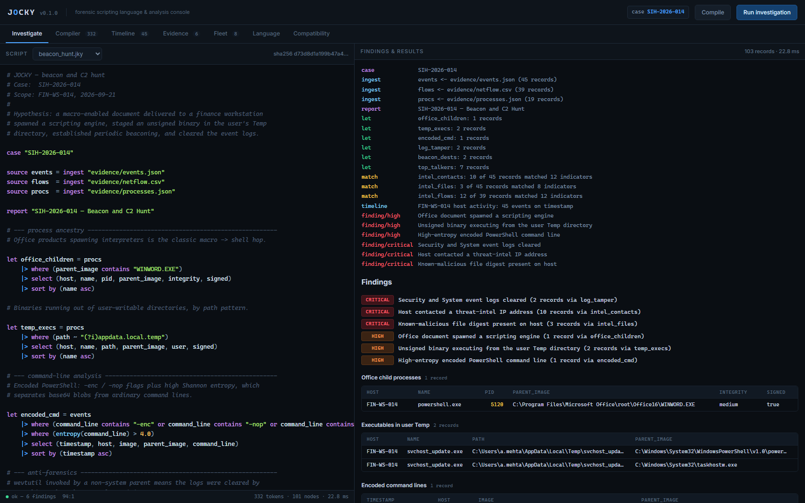

# JOCKY



**A forensic scripting language and analysis console for computer and network
investigation.**

JOCKY is a small domain-specific language for describing an investigation —
declare evidence, transform it, correlate it against threat intel, raise
findings — plus an operator console that runs those scripts against real data
and shows its work.

It is a working implementation, not a mockup. The lexer, parser, interpreter,
CLI, HTTP console and test suite are all real, and the whole thing runs on the
Python standard library with no dependencies.

```
  JOCKY v0.1.0  — forensic scripting language
  cross-platform forensic analysis runtime

  SIH-2026-014 — Beacon and C2 Hunt
  case SIH-2026-014

  ▸ ingest   events <- evidence/events.json (45 records)
  ▸ ingest   flows  <- evidence/netflow.csv (39 records)
  ▸ ingest   procs  <- evidence/processes.json (19 records)
  ▸ match    intel_contacts: 10 of 45 records matched 12 indicators
  ▸ timeline FIN-WS-014 host activity: 45 events on timestamp
  ▸ finding/critical Security and System event logs cleared

  FINDINGS
    ● CRITICAL Security and System event logs cleared  (2 records via log_tamper)
    ● CRITICAL Host contacted a threat-intel IP address  (10 records via intel_contacts)
    ● HIGH     Office document spawned a scripting engine  (1 record via office_children)
```

---

## The problem this solves

Forensic tooling has a real deployment problem, and it is not a glamorous one.
Unsigned, unfamiliar collectors get quarantined by endpoint protection the
moment they run, and the analyst loses exactly the evidence they came for.
Every DFIR team has hit this with memory acquisition tools, triage collectors
and live-response utilities.

There are two ways to respond. One is to make the tool harder to detect — to
obfuscate it, blind the security agent, and win an arms race against the very
product that is supposed to be protecting the host. That path produces tooling
nobody can safely deploy and output nobody can defend in a report.

JOCKY takes the other path: **work with the security stack instead of against
it.** Collect from documented sources the OS already exposes, ship signed and
reproducible builds, publish hashes so vendors can allowlist them, and keep a
full audit trail of what each script read. The result is something an
organisation can actually run on production endpoints — and evidence that
stands up afterwards.

The design constraints are listed in full under
[Scope and constraints](#scope-and-constraints), and the console surfaces them
in its **Compatibility** tab so they travel with the tool.

---

## Quickstart

Requires Python 3.8 or newer. Nothing else.

**Windows**

```powershell
.\run.ps1              # console at http://127.0.0.1:8787
.\run.ps1 -Demo        # run every script in the terminal
.\run.ps1 -Test        # test suite
```

**Ubuntu / macOS**

```bash
chmod +x run.sh
./run.sh               # console at http://127.0.0.1:8787
./run.sh --demo
./run.sh --test
```

**Directly**

```bash
python -m jocky run scripts/beacon_hunt.jky      # run an investigation
python -m jocky compile scripts/triage.jky --tokens
python -m jocky lint scripts/insider_usb.jky
python -m jocky env
python -m jocky serve --port 8787
python -m unittest discover -s tests -t .        # 50 tests
```

Optionally install the `jocky` command:

```bash
pip install -e .
jocky run scripts/beacon_hunt.jky
```

The scripts read their evidence with paths relative to the working directory,
so run them from the project root.

---

## The language

A JOCKY script is a sequence of statements. Data flows through pipelines, the
way it does in a shell — but the stages are forensic operations.

```
case "SIH-2026-014"

source events = ingest "evidence/events.json"
source flows  = ingest "evidence/netflow.csv"
source procs  = ingest "evidence/processes.json"

report "SIH-2026-014 — Beacon and C2 Hunt"

# Office products spawning interpreters is the classic macro -> shell hop.
let office_children = procs
    |> where (parent_image contains "WINWORD.EXE")
    |> select (host, name, pid, parent_image, integrity, signed)
    |> sort by (name asc)

# Encoded PowerShell: flags plus high Shannon entropy, which separates
# base64 blobs from ordinary command lines.
let encoded_cmd = events
    |> where (command_line contains "-enc" or command_line contains "-nop")
    |> where (entropy(command_line) > 4.0)
    |> select (timestamp, host, image, command_line)

# Beaconing signature: many small outbound flows to one external endpoint.
let beacon_dests = flows
    |> where (direction == "outbound")
    |> where (is_public_ip(dst_ip))
    |> where (bytes < 2000)
    |> group by (dst_ip, dst_port)

match events.dst_ip against "evidence/intel_ips.txt" as intel_contacts
match events.hash   against "evidence/intel_hashes.txt" as intel_files

timeline events on timestamp as "FIN-WS-014 host activity"

finding "Office document spawned a scripting engine" severity high from office_children
finding "Host contacted a threat-intel IP address" severity critical from intel_contacts

emit office_children as "Office child processes"
emit intel_contacts  as "Threat-intel IP contacts"
```

### Statement reference

| Form | Meaning |
|---|---|
| `case "ID"` | Name the investigation. |
| `source N = ingest "path"` | Declare evidence. `.json`, `.csv`, or one record per line. |
| `let N = expr` | Derive a result set. |
| `report "Title"` | Name the report. |
| `finding "text" severity S from N` | Raise a finding citing a result set. `S` ∈ `low`, `medium`, `high`, `critical`. |
| `match src.field against "intel.txt" as N` | Correlate a field against an indicator list. |
| `timeline src on field as "label"` | Build the case narrative. |
| `emit N as "Label"` | Include a result set in the report. |
| `print expr` | Write a value to the run log. |

### Pipeline stages

| Stage | Meaning |
|---|---|
| `where (cond)` | Filter records. |
| `select (a, b, c)` | Project fields. |
| `sort by (field asc\|desc)` | Order records. |
| `limit (n)` | Truncate. |
| `count` | Count records. |
| `group by (a, b)` | Bucket and count. |
| `distinct (field)` | Unique values with counts. |
| `as "Label"` | Tag a result set for display. |

### Operators

Comparison: `==` `!=` `<` `<=` `>` `>=`
Text: `contains` `startswith` `endswith` (case-insensitive), `~` / `matches` (regular expression), `in [ ... ]`
Logic: `and` `or` `not`, with parentheses

Comparisons are type-aware — `bytes > 1000000` compares numerically even though
CSV gives you strings, and a missing field is simply never a match rather than
an error.

### Built-in functions

| | |
|---|---|
| `sha256(x)` `md5(x)` | Hash a field value to compare against intel digests. |
| `entropy(x)` | Shannon entropy in bits/byte. Above ~4.5 usually means encoded, compressed or encrypted — the workhorse for spotting base64 command lines and packed payloads. |
| `is_public_ip(x)` `is_private_ip(x)` | Address classification, nil-safe on malformed input. |
| `lower` `upper` `len` `int` `abs` `round` | String and numeric helpers. |
| `now()` `epoch(x)` `age_minutes(x)` | Time helpers. |

### A note on string escapes

Only `\"`, `\'` and `\\` are escape sequences. Everything else is literal,
because JOCKY source is full of Windows paths and regular expressions:

```
" C:\Users\a\Temp "        →  C:\Users\a\Temp        (not a tab)
" (?i)appdata\.local "     →  (?i)appdata\.local    (backslash intact)
```

Use forward slashes for evidence paths; use `\\` only when you need a literal
backslash immediately before a quote.

---

## The console

`python -m jocky serve` opens an operator console on `127.0.0.1:8787`. It talks
to a local API that runs the real interpreter against the real evidence — edit
the script, hit **Run**, and the findings update.

| Tab | What it shows |
|---|---|
| **Investigate** | Script editor with live syntax highlighting, alongside the run log, findings and result tables. `Ctrl+Enter` runs. |
| **Compiler** | The actual token stream and AST the interpreter built. |
| **Timeline** | Chronological case narrative, with suspicious events called out. |
| **Evidence** | Every evidence file with its SHA-256, size, record count and a preview — chain of custody, computed not asserted. |
| **Fleet** | Managed hosts, agent versions, last check-in and status. |
| **Language** | Reference for statements, stages and built-ins, plus live runtime info. |
| **Compatibility** | The design constraints below, stated where an operator will see them. |

Tabs are deep-linkable: `http://127.0.0.1:8787/#timeline`.

---

## Scope and constraints

These are not aspirations — they are what the implementation does today, and
they are the boundary of the project.

**What JOCKY does**

- Reads JSON, CSV and line-based evidence; parses, analyses and correlates it
- Matches observed indicators against threat-intel lists
- Produces findings that cite the query and the record set behind them
- Records SHA-256 digests of every evidence file it read
- Runs identically on Windows and Ubuntu — one interpreter, no platform branches

**What JOCKY does not do, by design**

- No kernel manipulation, driver loading, or interference with EDR/AV callbacks
- No process injection, hollowing, or in-memory execution of secondary payloads
- No obfuscation, packing or polymorphism intended to defeat detection
- No domain fronting, CDN abuse or covert channels
- No privilege escalation, persistence, or credential access

The console binds to loopback only and rejects non-local requests. Evidence is
opened read-only; JOCKY never writes to a source system and performs no
automatic remediation.

---

## Project layout

```
jocky/
  lexer.py      source text → tokens (positions preserved for error reporting)
  parser.py     tokens → AST (recursive descent, plain dicts / JSON-safe)
  runtime.py    AST → findings, over loaded evidence
  builtins.py   entropy, hashing, address classification, time helpers
  cli.py        run / compile / lint / env / serve
  serve.py      console server and JSON API
console/
  index.html    the operator console (single file, no external assets)
scripts/        four investigation scripts
evidence/       sample evidence: a full incident on one workstation
tests/          50 unit tests
run.ps1         Windows launcher
run.sh          Linux/macOS launcher
```

### The sample case

`evidence/` contains one coherent incident on a finance workstation,
`FIN-WS-014`, on 2026-09-21: a macro-enabled document that spawns PowerShell,
stages an unsigned binary in the user's Temp directory, beacons to C2 on a
four-minute interval, clears the Security and System event logs, and stages
spreadsheets onto removable media. The threat-intel lists contain indicators
that actually match the captured events, so the correlation steps return real
hits.

It is synthetic, and deliberately so — it means the whole analysis is
reproducible from a clean checkout, with no live malware and nothing to
quarantine.

### The scripts

| Script | Question it answers |
|---|---|
| `triage.jky` | Who was active, what was running, what did not belong? |
| `beacon_hunt.jky` | Is this host beaconing, and to what? |
| `insider_usb.jky` | Where did data leave the workstation from? |
| `telemetry_audit.jky` | Which collectors are reporting, and can I trust the timeline? |

---

## Tests

```bash
python -m unittest discover -s tests -t . -v
```

50 tests covering the lexer (positions, escapes, comments), the parser
(precedence, keyword field names, error locations), the built-ins (entropy
ordering, address classification, nil-safety) and the runtime end to end
(filters, grouping, sorting, intel matching, findings, and the failure modes).

A few of them exist because they caught real bugs during development: `count`
being unusable as a field name after `group by`, and `\Temp` in a Windows path
being silently converted to a tab.

---

## Status

This is an alpha. The language, runtime and console are functional and tested;
what follows is the honest gap between this and a deployable product.

- **Collectors** — the fleet view is driven by a sample inventory. Real
  endpoint collectors (ETW on Windows, auditd/eBPF on Linux) are the next
  substantial piece of work.
- **Report export** — findings render in the console and print to the terminal.
  A signed PDF/JSON case export is straightforward but not written yet.
- **Storage** — evidence is loaded per run. A larger case wants an indexed
  store behind the same pipeline interface.
- **Timeline correlation** — a single host today; multi-host correlation is
  designed for in the data model but not implemented.

---

## Licence

MIT.
